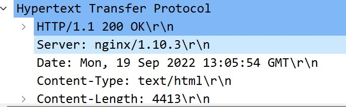
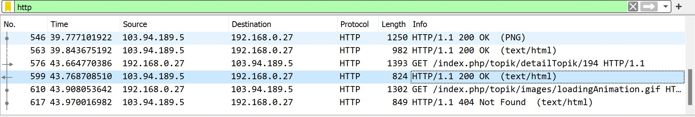
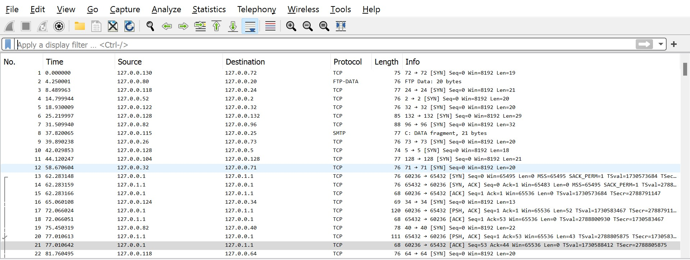
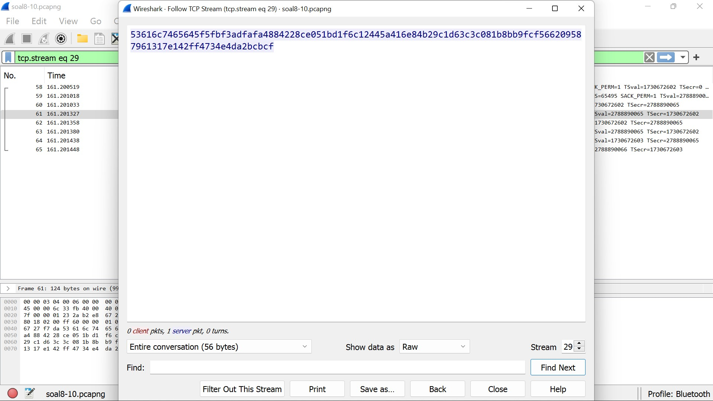

# Jarkom-Modul-1-E13-2022

## Dhafin Almas Nusantara - 5025201064

## No 1

Sebutkan web server yang digunakan pada "monta.if.its.ac.id"!

**Jawaban :**

filter wireshark menggunakan `http` agar hanya paket _http_ saja yang akan muncul.

lalu klik dua kali pada baris manapun dan kita lihat pada _transfer protokol_ nya kita dapat ketahui bahwa webserver yang dipakai adalah **nginx/1.10.3**.

## No 2

Ishaq sedang bingung mencari topik ta untuk semester ini , lalu ia datang ke website monta dan menemukan detail topik pada website “monta.if.its.ac.id” , judul TA apa yang dibuka oleh ishaq ?

**Jawaban :**

filter wireshark menggunakan _`http` agar hanya paket \_http_ saja yang akan muncul.

lalu klik dua kali pada _text html_ yang terdekat dengan _detail topik_ dan dapat dilihat dalam html nya bahwa judul TA yang dimaksud adalah **Evaluasi unjuk kerja User Space Filesystem**.

## No 3

Filter sehingga wireshark hanya menampilkan paket yang menuju port 80!

**Jawaban :**

Untuk menampilkan paket yang menuju port 80 gunakan filter
`tcp.dstport == 80`.

## No 4

Filter sehingga wireshark hanya menampilkan paket yang barasal dari port 21!

**Jawaban :**

Untuk menampilkan paket yang berasal dari port 21 gunakan filter.
`tcp.srcport == 21`

## No 5

Filter sehingga wireshark hanya menampilkan paket yang berasal port 443!

**Jawaban :**

Untuk menampilkan paket yang berasal port 443 gunakan filter.
`tcp.dstport == 80`

## No 6

Filter sehingga wireshark hanya menampilkan paket yang menuju ke lipi.go.id !

**Jawaban :**

Untuk menampilkan paket yang menuju _lipi.go.id_ kita gunakan filter `http contains "lipi.go.id"` agar menampilkan http yang didalamnya ditemukan string _lipi.go.id_.

Setelah menangkap paket yang terdapat string tersebut, maka kita sekarang dapat mengetahui ip server dari _lipi.go.id_ yaitu _203.160.128.158_ dan kita gunakan `ip.dst==203.160.128.158` untuk menampilkan hanya paket yang mengarah ke _lipi.go.id_.

## No 7

Filter sehingga wireshark hanya mengambil paket yang berasal dari ip kalian!

**Jawaban :**

Untuk melihat kita, gunakan syntax `ipconfig` pada command line atau windowns powershell.

Setelah mengetahui ip nya, maka kita hanya perlu melakuakan filter untuk mengambil paket yang berasal dari ip tersebut dengan `ip.src== <ip yang ditemukan>`.

## No 8

Telusuri aliran paket dalam file .pcap yang diberikan, cari informasi berguna berupa percakapan antara dua mahasiswa terkait tindakan kecurangan pada kegiatan praktikum. Percakapan tersebut dilaporkan menggunakan protokol jaringan dengan tingkat keandalan yang tinggi dalam pertukaran datanya sehingga kalian perlu menerapkan filter dengan protokol yang tersebut.

**Jawaban :**

kita lihat bahwa ip yang sering muncul adalah transfer data antara _127.0.0.1_ dan _127.0.1.1_ maka diindikasi dua mahasiswa yang melakukan percakapan adalah ip tersebut.

setelah itu kita gunakan follow with tcp stream.

maka akan kita temukan ada percakpan tersebunyi yang dimaksud oleh soal.

## No 9

Terdapat laporan adanya pertukaran file yang dilakukan oleh kedua mahasiswa dalam percakapan yang diperoleh, carilah file yang dimaksud! Untuk memudahkan laporan kepada atasan, beri nama file yang ditemukan dengan format [nama_kelompok].des3 dan simpan output file dengan nama “flag.txt”.

**Jawaban :**

Sesuai Intruksi pesan yang ditemukan ,lalu kita search port yang telah ada pada pesan tersebut yaitu _9002_ dengan `tcp.port==9002`

<!--  -->

lalu kita klik paket follow tcp stream, maka akan ditemukan file salted

lalu kita rubah menjadi raw agar dapat di decrpyt nantinya dan klik save as denagn extension des.3 agar tersimpan pada komputer.

lalu lakukan decrpyt dengan menggunakan syntax openssl pada wsl dan password untuk decrypt ny adalah **nakano** sesaui clue yang ada pada pesan tersembunyi yang telah kita temukan.

## No 10

Temukan password rahasia (flag) dari organisasi bawah tanah yang disebutkan di atas!

**Jawaban :**

Maka akan ditemukan file dengan hasil berikut setelah di decrypt

